# Wordle Solver — Sequence & Flow Diagrams

View this file in VS Code (Markdown Preview) or GitHub to render **Mermaid** diagrams.

## Quick index

| Topic | Flowchart | Sequence |
|-------|-----------|----------|
| `solve` | [§0](#0-solve-high-level-flowchart) | [§1](#1-end-to-end-one-full-game-solve) |
| `load_words` | [§9](#9-load_words-flowchart) | [§10](#10-load_words-sequence) |
| Votee API | — | [§11](#11-votee-api-guess-requests) |
| `filter_words` | [§12](#12-filter_words-flowchart) | [§3](#3-filter_words-how-consistency-is-checked) |
| `pick_best_guess` | [§4](#4-pick_best_guess-decision-flow-activity-diagram) | [§5–6](#5-pick_best_guess-partition-step-mid-size-pool) |
| Sacrifice logic | [§13](#13-sacrifice-guess-explained-with-example) | [§6](#6-pick_best_guess-sacrifice--cluster-step-optional-probe) |
| `evaluate_guess` | [§7](#7-evaluate_guess-flowchart-duplicate-letter-safe-logic) | [§8](#8-evaluate_guess-sequence-diagram-what-changes-each-pass) |

---

## 0) `solve`: high-level flowchart

Use this as a **single-page mental model** before diving into API vs filter details.

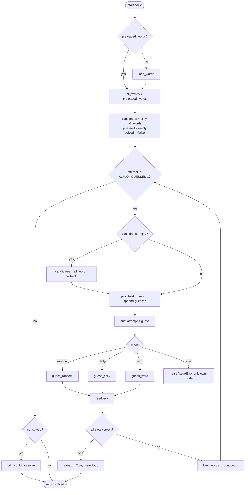

---

## 1) End-to-end: one full game (`solve`)

Shows how the main loop ties together loading words, picking a guess, calling the API, and filtering candidates.

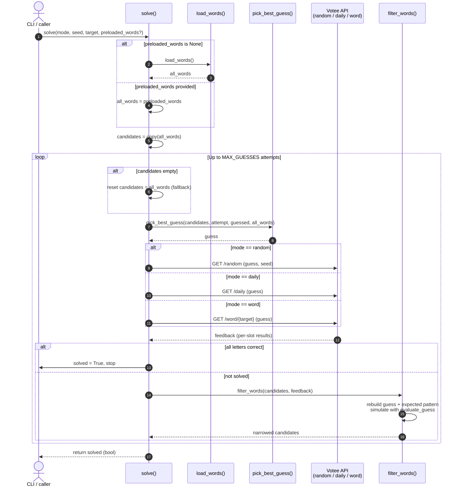

---

## 2) Single guess: API + filter (detail)

Use this when explaining **one iteration** of the loop.

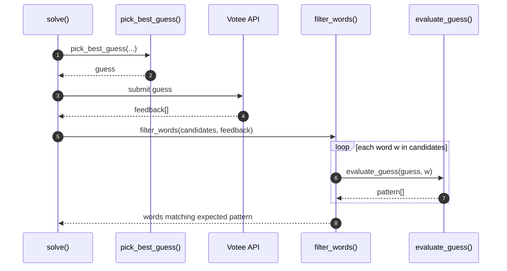

---

## 3) `filter_words`: how consistency is checked

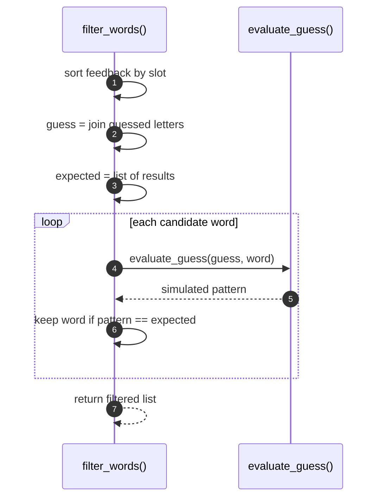

---

## 4) `pick_best_guess`: decision flow (activity diagram)

Strict “sequence between objects” is awkward here because almost everything is **branching inside one function**. An **activity / flowchart** matches the code order and is easier to follow step by step.

```mermaid
flowchart TD
    A([start pick_best_guess]) --> B{attempt == 0?}
    B -->|yes| B1[return crane if in words else words[0]]
    B1 --> Z([end])
    B -->|no| C{words empty?}
    C -->|yes| C1[return None]
    C1 --> Z
    C -->|no| D[build candidate_pool = unguessed words]
    D --> E{candidate_pool empty?}
    E -->|yes| F[candidate_pool = words]
    E -->|no| G{len candidate_pool == 1?}
    F --> G
    G -->|yes| G1[return that word]
    G1 --> Z
    G -->|no| H[compute letter_freq over words]
    H --> I{len words <= 10 AND attempt < last AND all_words?}
    I -->|yes| J[get_cluster_signature]
    J --> K{cluster exists?}
    K -->|no| N1
    K -->|yes| L[sacrifice_pool from all_words]
    L --> M{sacrifice_pool non-empty?}
    M -->|no| N1
    M -->|yes| SacPick[best_sacrifice = max sacrifice_score]
    SacPick --> SacHit{best_sacrifice hits a differing letter?}
    SacHit -->|yes| P1[return best_sacrifice]
    P1 --> Z
    SacHit -->|no| N1
    I -->|no| N1
    N1{len words <= 10?}
    N1 -->|yes| Endgame[endgame_score: max over candidate_pool]
    Endgame --> Z
    N1 -->|no| N2{len words <= 200?}
    N2 -->|yes| Part[partition_score using evaluate_guess buckets]
    Part --> Z
    N2 -->|no| Cov[coverage_score only: max over candidate_pool]
    Cov --> Z
```

---

## 5) `pick_best_guess`: partition step (mid-size pool)

Explains what happens inside the `len(words) <= 200` branch.

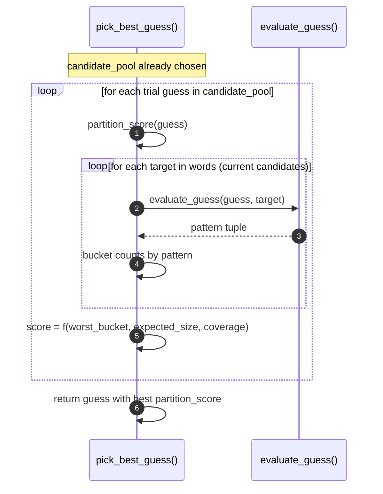

---

## 6) `pick_best_guess`: sacrifice / cluster step (optional probe)

```mermaid
sequenceDiagram
    autonumber
    participant Pick as pick_best_guess()
    participant Cluster as get_cluster_signature()
    participant Sacrifice as sacrifice_pool<br/>(from all_words)

    Pick->>Cluster: get_cluster_signature(words)
    Cluster->>Cluster: per index: fixed vs varying letters
    Cluster-->>Pick: None OR (fixed_positions, varying_positions)

    alt cluster is None
        Pick->>Pick: skip sacrifice block
    else cluster found
        Pick->>Pick: differing_letters from varying slots
        Pick->>Sacrifice: filter: not in words, not guessed
        Sacrifice-->>Pick: sacrifice_pool
        alt sacrifice_pool empty
            Pick->>Pick: skip return
        else
            Pick->>Pick: best_sacrifice = max by sacrifice_score
            alt overlaps differing letters
                Pick-->>Pick: return best_sacrifice
            end
        end
    end
```

---

## 7) `evaluate_guess`: flowchart (duplicate-letter safe logic)

Use this to explain why the solver handles duplicate letters correctly.

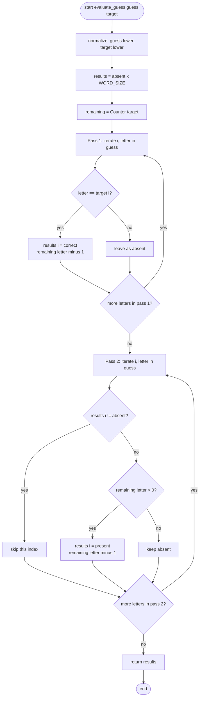

---

## 8) `evaluate_guess`: sequence diagram (what changes each pass)

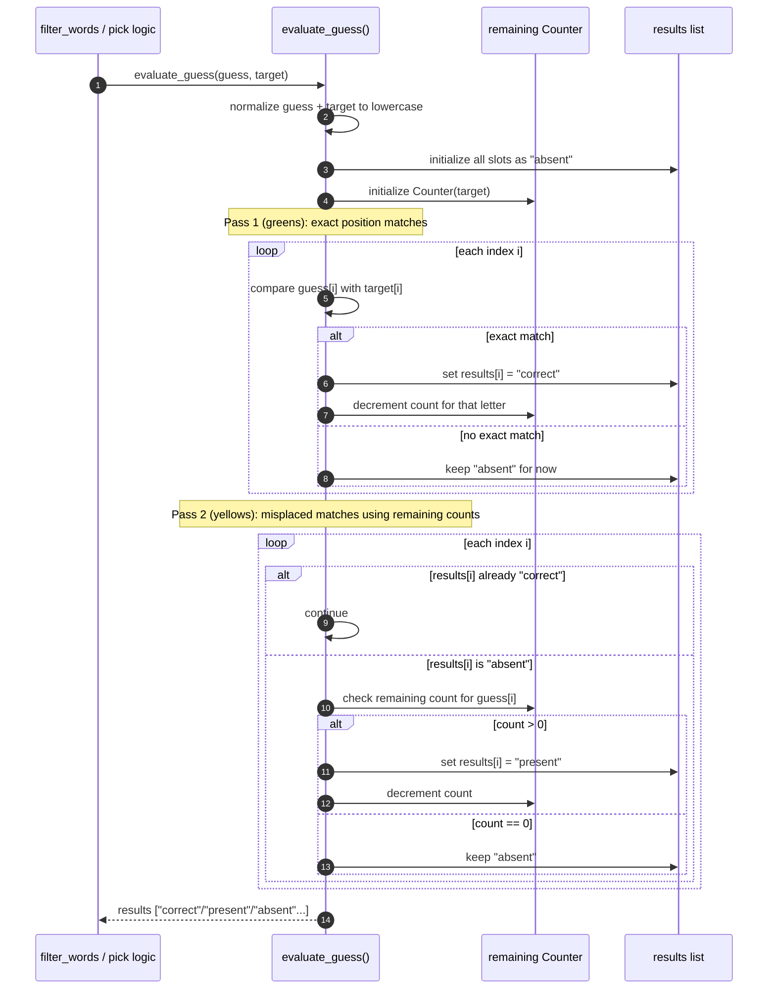

---

## 9) `load_words`: flowchart

Shows the three-tier fallback: system dictionary → download URLs → hardcoded list.

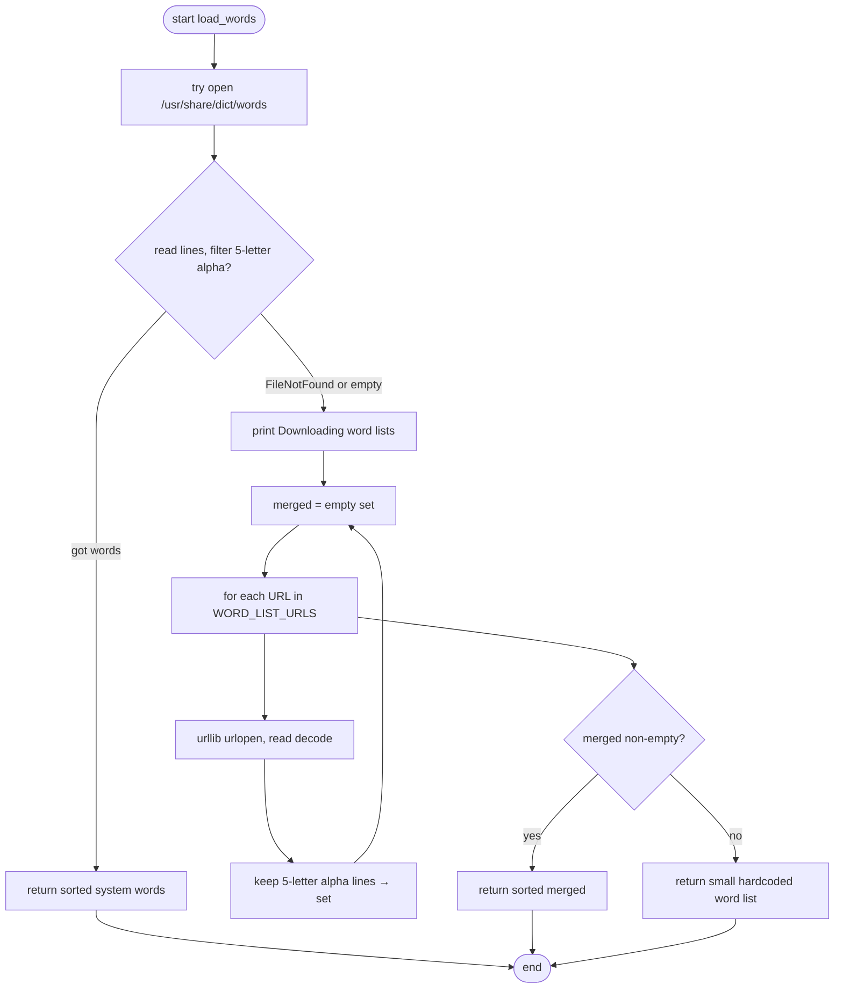

---

## 10) `load_words`: sequence

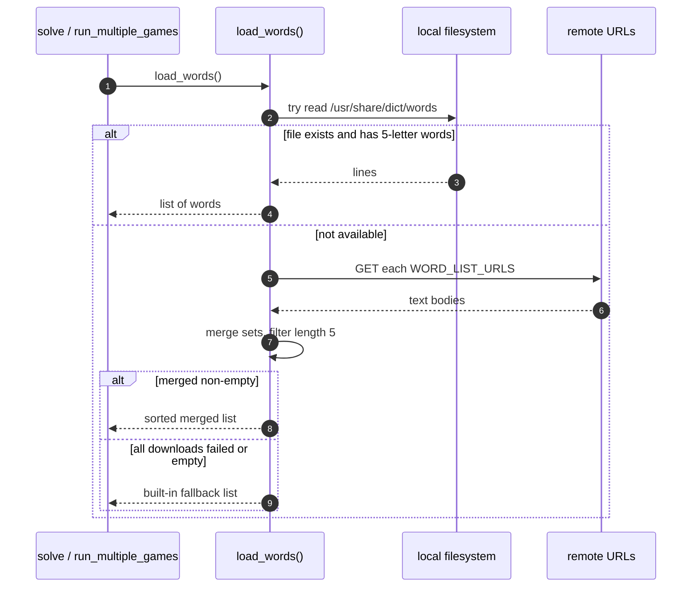

---

## 11) Votee API: guess requests

All endpoints share `BASE_URL` and return JSON feedback (list of `{slot, guess, result}`).

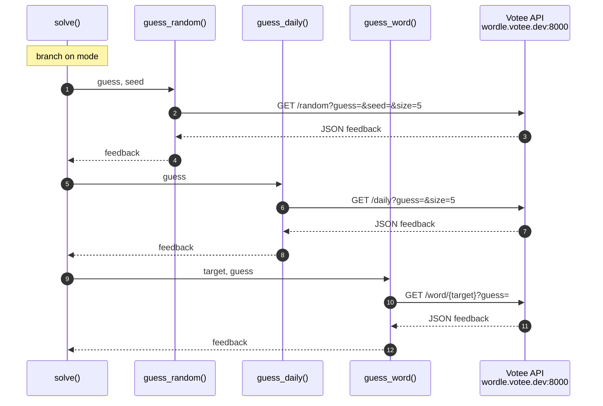

---

## 12) `filter_words`: flowchart

Complements the sequence in **§3**: same logic, shown as a decision tree.

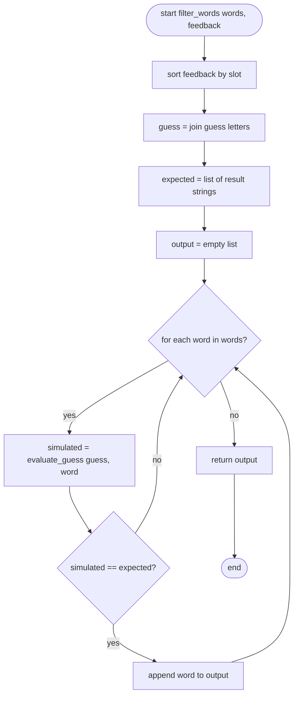

---

## 13) Sacrifice guess: explained (with example)

### Why sacrifice exists

Sometimes the remaining answers are **almost the same word** — they agree on 4 positions and only differ in 1–2 slots (a tight **cluster**). Guessing only from that small set can waste turns: each guess might eliminate only one word. A **sacrifice guess** is a word **outside** the current candidate list (but from the full dictionary) chosen to **test letters** that distinguish those answers, so one feedback round splits the cluster faster.

### When it runs (code gates)

All must be true:

- `len(words) <= 10` (small candidate pool)
- `attempt < MAX_GUESSES - 1` (not the last allowed guess)
- `all_words` is provided (full dictionary for probes)
- `get_cluster_signature(words)` returns a cluster: **at least 4 positions fixed** across all candidates, and **at least one varying position** (so not already solved)

### What `get_cluster_signature` does

For each index `0..4`, it looks at which letters appear in that position across **all** current candidates:

- If every candidate has the **same** letter there → that index is **fixed**.
- If candidates disagree → that index is **varying** (a set of possible letters).

If there are **4+ fixed** indices and **some varying** indices, you have a **cluster** (many words share a long prefix/suffix pattern).

### Toy example (pattern only)

Imagine candidates are like `*_IGHT` family words that all share `I G H T` in the last four positions but differ in the first letter. Then positions 1–4 might look “fixed” in the code’s view depending on overlap — the **varying** slot contributes **differing letters**. The sacrifice pool picks words from `all_words` that are **not** in the current `words` list, scores them by how many of those **differing** letters they include and whether they place them in **varying** slots, and may return the best probe **if** it touches at least one differing letter.

### Flowchart: cluster detection + sacrifice decision

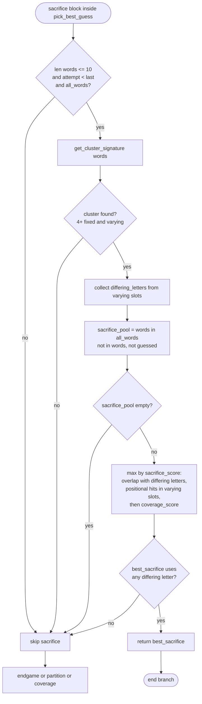

### Mental model (one sentence)

> **Sacrifice = optional probe from the full dictionary when candidates form a tight cluster, to learn which distinguishing letter is correct without burning guesses only cycling through near-identical answers.**

---

## Tips for your interview

- **§0 + §1** together tell the `solve` story: flowchart for structure, sequence for interactions.
- **`load_words`**: **§9–10** — three-tier fallback and who calls it.
- **Votee API**: **§11** — three GET shapes; mention `raise_for_status()` in code if asked.
- **`filter_words`**: **§3** sequence + **§12** flowchart — same logic, pick one style.
- **`pick_best_guess`**: **§4** main flowchart; **§5** partition; **§6** sacrifice sequence; **§13** sacrifice prose + cluster flowchart if you struggle with it.
- **`evaluate_guess`**: **§7–8** — duplicate-letter safety.
- If asked **partition vs sacrifice**: partition splits **mid-size** pools by feedback patterns; sacrifice breaks **tiny near-duplicate** clusters using **non-candidate** probes.
